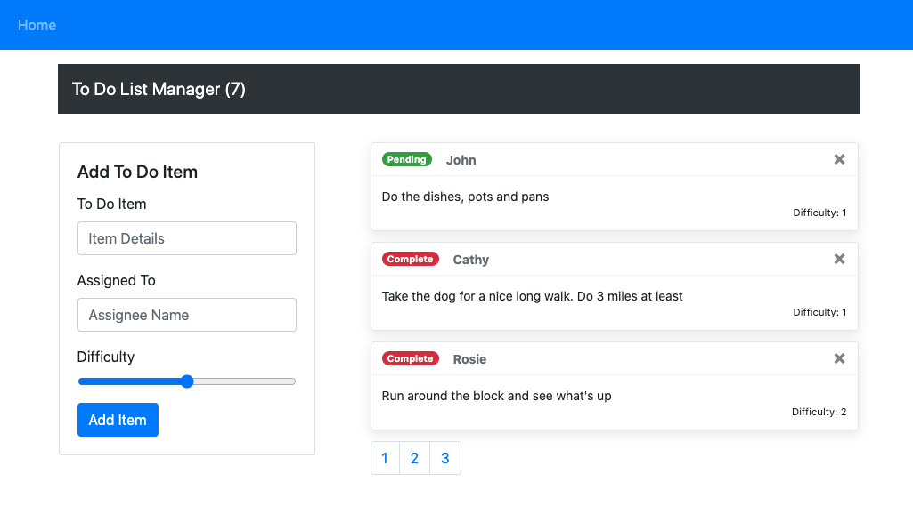

# LAB - Todo-App - Context API

[Live Todo-App](https://rhea-todo-app.netlify.app/)

**To Do List Manager Phase 1:** Incorporate configuration settings to the application

In this phase, we'll be adding some top-level settings for the application, so that the user can make some display choices that the app will use by default.

## Testing

- Tests should assert all behavioral functionality
- Do a deep mount of the app, and set tests to make assertions on the child components that consume context from the Provider.
  - Can they see context?

## Documentation

### Global State

- Global state is consumed by components that use user input to dynamically change layout and functionality, such as how many TODOs to display at a time.

### `useForm()`

- `useForm()` is a custom hook accepts a callback and default values, this listens for events, like onChange and onSubmit.
  - when creating an instance of `useForm()`, we pass in an external callback and some default values
  - onChange => `useForm()` appends event values to `useForm()`'s own internal state
  - onSubmit => send `values` in internal state to an external callback and run the callback

## References

1. [The magic behind 💅 styled-components](https://mxstbr.blog/2016/11/styled-components-magic-explained/)
2. [How To Use Styled-Components In React](https://www.smashingmagazine.com/2020/07/styled-components-react/)
3. [Styled Components Documentation](https://styled-components.com/docs)
4. [Local Storage](https://www.w3schools.com/html/html5_webstorage.asp)
5. [Local Storage JSON Refresher](https://stackoverflow.com/a/2010948)
6. [Extend Local Storage For Easy Setting and Getting](https://stackoverflow.com/a/2010994)
