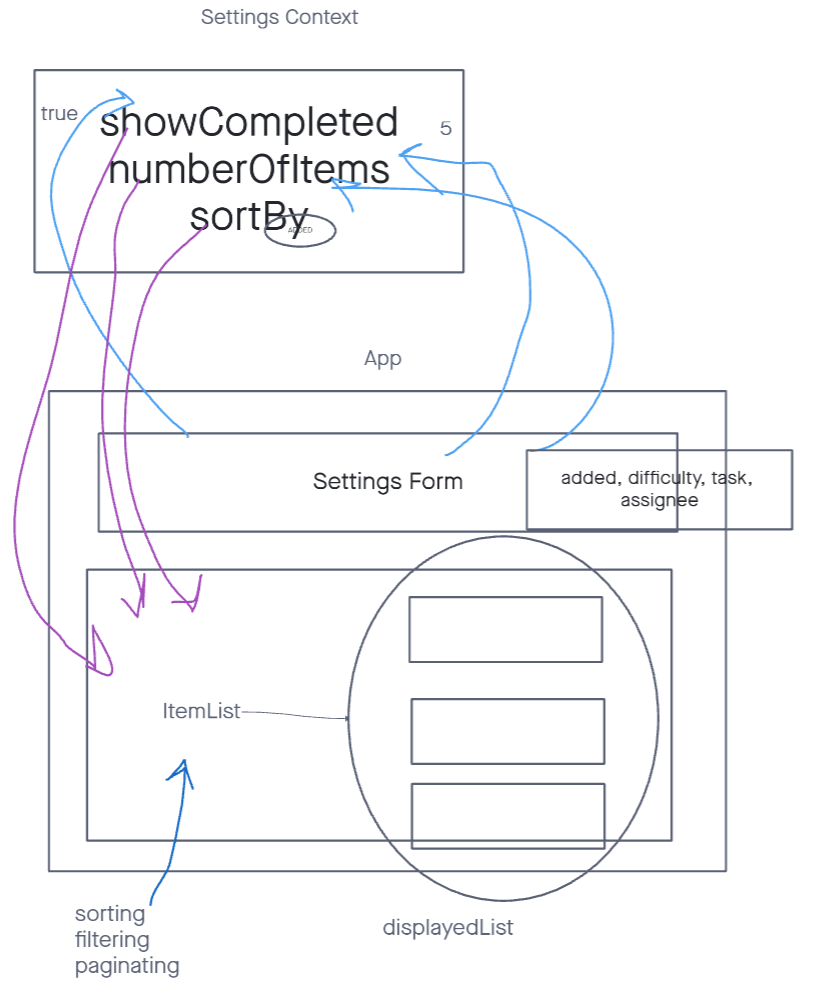
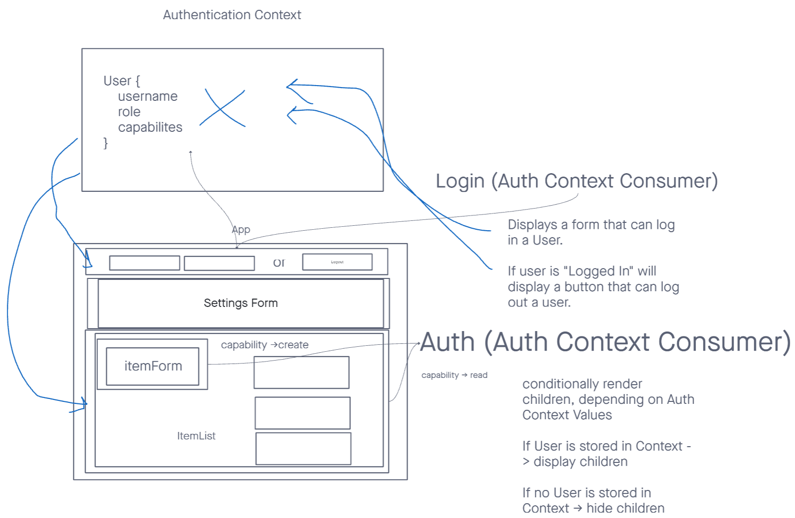

# LAB - Todo-App - Context API

Todo List app with RBAC and Auth

[Live Todo-App](https://rhea-todo-app.netlify.app/)

## Testing

My test suite covers the following test cases:

1. Adding and rendering list items
2. Updating the header's count of incomplete items
3. Rendering the page with context settings
4. Saving and loading context settings with local storage

## Documentation

### Global State

- Global state is consumed by components that use user input to dynamically change layout and functionality, such as how many TODO list items to display at a time.

### `useForm()`

- `useForm()` is a custom hook accepts a callback and default values, this listens for events, like onChange and onSubmit.
  - when creating an instance of `useForm()`, we pass in an external callback and some default values
  - onChange => `useForm()` appends event values to `useForm()`'s own internal state
  - onSubmit => send `values` in internal state to an external callback and run the callback

### UML

**Settings Context**

**Auth**

## References

1. [The magic behind 💅 styled-components](https://mxstbr.blog/2016/11/styled-components-magic-explained/)
2. [How To Use Styled-Components In React](https://www.smashingmagazine.com/2020/07/styled-components-react/)
3. [Styled Components Documentation](https://styled-components.com/docs)
4. [Local Storage](https://www.w3schools.com/html/html5_webstorage.asp)
5. [Local Storage JSON Refresher](https://stackoverflow.com/a/2010948)
6. [Extend Local Storage For Easy Setting and Getting](https://stackoverflow.com/a/2010994)
7. [Snack Bars wtih Context](https://medium.com/swlh/snackbars-in-react-an-exercise-in-hooks-and-context-299b43fd2a2b)
8. [Clear Input values after form submit in React](https://bobbyhadz.com/blog/react-clear-input-after-submit#:~:text=To%20clear%20input%20values%20after,state%20variables%20to%20empty%20strings.)
